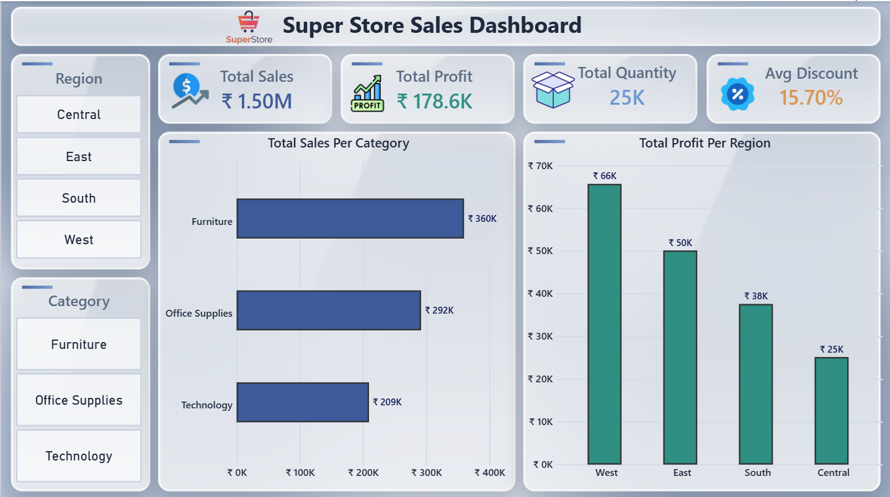
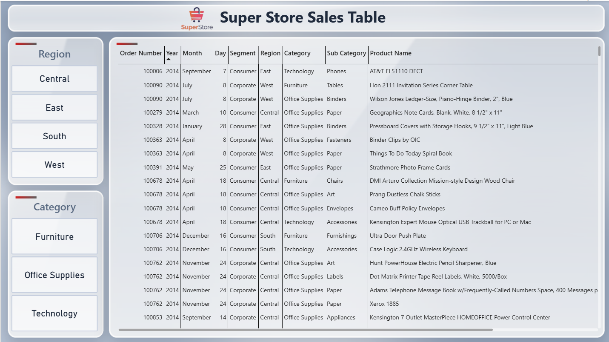

<div align="center">

# 📊 Super Store Sales Dashboard
### *Power BI Sales Analysis & Interactive Dashboard Project*


**Power BI · Practical Report 1 (PR 1)**

</div>

---

# 📋 Table of Contents

- [📌 Overview](#-overview)
- [🎯 Objective](#-objective)
- [📦 Dataset](#-dataset)
- [✨ Features](#-features)
- [🏗️ Repository Structure](#️-repository-structure)
- [🗂️ Report Pages](#️-report-pages)
  - [📊 Page 1: Sales Overview](#-page-1-sales-overview)
  - [📄 Page 2: Order Details](#-page-2-order-details)
- [🧹 Power Query Transformations](#-power-query-transformations)
- [🔍 Filters](#-filters)
- [🔗 Visual Interactions](#-visual-interactions)
- [🎨 Theme & Formatting](#-theme--formatting)
- [💡 Key Insights](#-key-insights)
- [🛠️ Tools & Techniques](#️-tools--techniques)
- [🚀 How to Use This Project](#-how-to-use-this-project)
- [🎥 Video Walkthrough](#-video-walkthrough)
- [📈 Learning Outcomes](#-learning-outcomes)
- [👤 Author](#-author)

---

# 📌 Overview

**Super Store Sales Dashboard** is a Microsoft Power BI project that turns the raw Superstore sales dataset into a clean, interactive report.

The report has **two pages**:

- 📊 **Sales Overview**: KPI cards, bar charts and slicers
- 📄 **Order Details**: a detailed order-level data table

The project covers the full Power BI workflow: loading data, cleaning it in Power Query, building visuals, adding slicers and filters, setting up cross-filtering, and applying a consistent theme.

---

# 🎯 Objective

The main objective of this project is to analyze Superstore sales data in Power BI and present the results in a professional dashboard.

The project focuses on:

- Connecting to a data source
- Cleaning and transforming data in Power Query
- Creating KPI cards
- Building and formatting bar charts
- Adding slicers and configuring the Filters pane
- Formatting the report page and applying a theme
- Configuring visual interactions (cross-filtering)
- Creating a second page with a detailed data table

---

# 📦 Dataset

| Field | Detail |
|---|---|
| **Dataset Name** | Sample Superstore Sales Dataset |
| **Source** | Kaggle |
| **Link** | [Superstore Dataset (Kaggle)](https://www.kaggle.com/datasets/vivek468/superstore-dataset-final) |
| **Format** | CSV / Excel (.xlsx) |
| **Rows** | ~9,994 rows (before filtering) |
| **Key Columns** | Order Date, Ship Date, Ship Mode, Segment, City, State, Region, Category, Sub-Category, Product Name, Sales, Quantity, Discount, Profit |

---

# ✨ Features

- 💰 4 KPI cards: Total Sales, Total Profit, Total Quantity, Average Discount
- 📊 2 formatted clustered bar charts with data labels
- 🎛️ 2 tile slicers: Region and Category
- 🔍 Page-level and visual-level filters
- 🔗 Cross-filtering across 3+ visual pairs
- 📄 Second page with a detailed order data table
- 🎨 Custom silver glass design with consistent theme
- 📐 16:9 layout (1280 × 720) with aligned visuals

---

# 🏗️ Repository Structure

```text
📦 Super-Store-Sales-Dashboard
│
├── 📊 SuperStore_Dashboard.pbix          → Power BI report file
│
├── 📄 Dataset
│      └── Sample - Superstore.csv        → Raw dataset
│
├── 🎨 Theme
│      ├── Page1_Theme.png                → Page 1 background design
│      └── Page2_Theme.png                → Page 2 background design
│
├── 🗂️ Asset
│      ├── 🖼️ Icons
│      │      ├── growth.png
│      │      ├── package.png
│      │      ├── profit.png
│      │      ├── sale.png
│      │      └── superstore_logo_transparent.png
│      │
│      └── 📸 Images
│             ├── Page_1.png              → Sales Overview screenshot
│             └── Page_2.png              → Order Details screenshot
│
└── 📝 README.md
```

---

# 🗂️ Report Pages

## 📊 Page 1: Sales Overview

The **Sales Overview** page gives a quick visual summary of sales performance. The header holds the logo and title, the two slicers sit on the left, the KPI cards run across the top, and the two bar charts fill the rest of the page.

### KPI Cards

| KPI | Field | Aggregation |
|---|---|---|
| 💰 Total Sales | Sales | Sum |
| 📈 Total Profit | Profit | Sum |
| 📦 Total Quantity | Quantity | Sum |
| 🏷️ Average Discount | Discount | Average |

### Bar Charts

| Chart | Axis | Values | Sort |
|---|---|---|---|
| Total Sales Per Category | Category | Sales | Descending |
| Total Profit Per Region | Region | Profit | Descending |

Both charts have data labels turned on, vertical gridlines removed and meaningful titles.

### Slicers

| Slicer | Field | Style |
|---|---|---|
| Region | Region | Tile |
| Category | Category | Tile |

### 📸 Dashboard Screenshot



---

## 📄 Page 2: Order Details

The **Order Details** page contains a table visual that lists the order-level data behind the numbers on page 1. The Region and Category slicers are **synced** with page 1, so a selection on one page filters both pages.

### Table Columns

- Order Number
- Year / Month / Day
- Segment
- Region
- Category
- Sub Category
- Product Name

### 📸 Sales Table Screenshot



---

# 🧹 Power Query Transformations

The raw data was cleaned in the Power Query Editor before loading it into the model.

| # | Step | Details |
|---|---|---|
| 1 | **Connect to data source** | Loaded the Superstore CSV / Excel file through Get Data |
| 2 | **Promote headers** | Used the first row as column names |
| 3 | **Rename columns** | Renamed columns to readable names (for example, `Sub-Category` → `Sub Category`, `Order ID` → `Order Number`) |
| 4 | **Change data types** | Order Date → Date, Sales → Decimal, Quantity → Whole Number, Discount → Decimal, Profit → Decimal |
| 5 | **Remove nulls** | Checked Sales and Profit for null values and removed those rows |
| 6 | **Filter rows** | Kept only the **Consumer** and **Corporate** segments (removed Home Office) |
| 7 | **Split column** | Split `Order ID` by the `-` delimiter to extract the order code |
| 8 | **Remove unnecessary columns** | Removed Row ID, Country and Postal Code |
| 9 | **Close & Apply** | Loaded the cleaned data into the model |

---

# 🔍 Filters

| Filter | Level | Configuration |
|---|---|---|
| Ship Mode | **Page-level** | Standard Class and Second Class |
| Sub Category | **Visual-level** | Top 5 Sub-Categories by Sales (on one bar chart) |

The filters were tested with the slicers to confirm they work together without conflict.

---

# 🔗 Visual Interactions

Cross-filtering was configured using **Format → Edit Interactions**.

| Source Visual | Target Visual | Behavior |
|---|---|---|
| Total Sales Per Category | Total Profit Per Region | Filter |
| Total Sales Per Category | KPI Cards | Highlight |
| Total Profit Per Region | Total Sales Per Category | Filter |

Tested by clicking a bar (for example, **Technology**) and checking that the other visuals filter or highlight correctly.

---

# 🎨 Theme & Formatting

### Page Setup

- Page size: **16:9 (1280 × 720)**
- Canvas background: light grey `#F5F5F5` with a custom silver glass background image
- Snap to Grid and Gridlines enabled for neat alignment

### Color Palette

| Use | Color | Hex |
|---|---|---|
| Primary (Sales bars) | 🔴 Red | `#CC0000` |
| Secondary (Profit bars) | ⚫ Charcoal | `#4A4A4A` |
| Text | Dark gray | `#2B2B2B` |
| Wallpaper | Slate silver | `#A4B1C5` |
| Gridlines | Pale silver | `#D5DCE8` |

### Fonts

| Element | Font |
|---|---|
| Titles | Segoe UI Semibold |
| KPI values | DIN, 28 pt, bold |
| Labels and axes | Segoe UI, 10 pt |

---

# 💡 Key Insights

> Based on the filtered data (Consumer & Corporate segments, Standard Class & Second Class shipping).

- 💰 Total sales are about **₹1.50M**, with a total profit of about **₹178.6K**
- 📦 About **25K units** were sold, with an average discount of **15.70%**
- 🛋️ **Furniture** has the highest sales (about ₹360K), followed by Office Supplies (about ₹292K) and Technology (about ₹209K)
- 🌎 The **West** region earns the most profit (about ₹66K), followed by East (₹50K) and South (₹38K)
- 📉 The **Central** region has the lowest profit (about ₹25K), so it is the main area for improvement

---

# 🛠️ Tools & Techniques

| Tool / Feature | Purpose |
|---|---|
| Microsoft Power BI Desktop | Report building and visualization |
| Power Query Editor | Data cleaning and transformation |
| Card Visuals | KPI display |
| Clustered Bar Charts | Category and region comparison |
| Slicers (Tile) | Interactive filtering |
| Table Visual | Detailed order data |
| Filters Pane | Page-level and visual-level filters |
| Edit Interactions | Cross-filtering between visuals |
| Sync Slicers | Same slicer selection on both pages |
| Report Theme (JSON) | Consistent colors and fonts |
| Python (Pillow) | Creating the custom background images |
| GitHub | Version control and project hosting |

---

# 🚀 How to Use This Project

1. **Clone** this repository

   ```bash
   git clone https://github.com/tirthdonga/Super-Store-Sales-Dashboard.git
   ```

2. **Open** `SuperStore_Dashboard.pbix` in **Power BI Desktop**
3. If Power BI cannot find the data, go to **Home → Transform data → Data source settings → Change Source** and point it to the CSV file in the `Dataset` folder
4. Click **Refresh** to reload the data
5. *(Optional)* Import the theme: **View → Themes → Browse for themes** → select `Theme/superstore_silver_theme.json`
6. Use the **Region** and **Category** slicers to explore the report, and click any bar to cross-filter the other visuals

---

# 🎥 Video Walkthrough

A 5–10 minute recorded walkthrough (face + screen) explains every task of this project.

🔗 **[Watch the video here](YOUR_VIDEO_LINK_HERE)**

---

# 📈 Learning Outcomes

- ✅ Connect Power BI to a data source
- ✅ Clean and transform data in Power Query
- ✅ Understand the Fields and Visualizations panes
- ✅ Create and format KPI cards
- ✅ Build, sort and label bar charts
- ✅ Add slicers and use page-level and visual-level filters
- ✅ Format the report page and apply a theme
- ✅ Configure cross-filtering between visuals
- ✅ Build a multi-page report with consistent design
- ✅ Present data through clear visual storytelling

---

# 👤 Author

<div align="center">

# Tirth Donga

[](https://github.com/tirthdonga)

**Super Store Sales Dashboard – Power BI Project**

*Red & White Skill Education · Power BI · PR 1*

---

### ⭐ Thank You For Visiting This Project ⭐

Made with ❤️ using Microsoft Power BI

</div>
